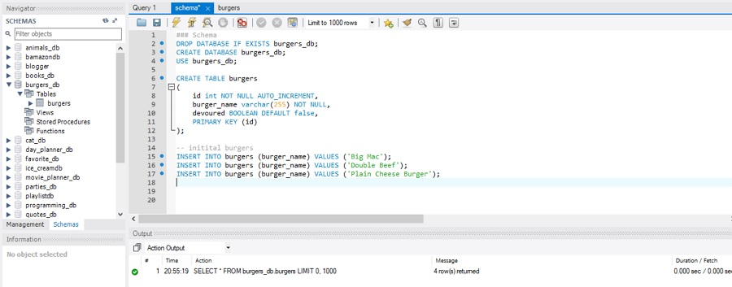
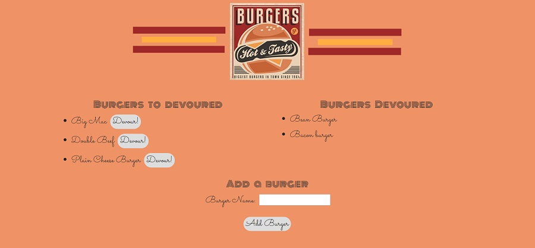

# Eat-A-Burger

## Description

This is a full-stack application that utilizes MySQL, Node, Express, Handlebars and ORM. It uses Node and MySql to query and route data to the app for the back-end and Handlebars to generate the HTML to the front-end.

### MySQL Database Setup

In order to run this application, you should have the MySQL database already set up on your machine.  You will be able to create the *burgers_db* database and the *burgers* table with the SQL code found in [schema.sql](schema.sql). Run this code inside your MySQL client to populate the database, then you will be ready to proceed with running the server.js file from node.

**MySQL Database Setup Screenshot**

### The Burger Webpage

Within the burger webpage you have the ability to: see current burgers, change the burger's state from 'To be Devoured' to 'Devoured', and add a new burger. To switch burger states all you need to do is select the 'Devour' button in the left column beside the burger you want to devour. To add a burger you'll type the burger you'd like to add in the empty form under 'Add a Burger' and press enter or click the button below the field. Once you do this, the burger will be added to the 'To be Devoured' section.

To run the burger app locally on your PC/Mac please follow the steps below:

	-git clone https://github.com/dhrandy/burger.git
	-cd burger
	-npm install or i
	-node server or server.js
    -navigate to the config/connection.js folder and scroll to the bottom. Comment out everything between the equal signs.

    You'll need to create a .dotenv file in the root directory and add your password.

**Burger App**

